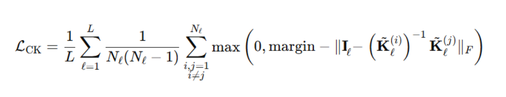

# Contrastive Kernel Loss

This repository implements the **Contrastive Kernel Loss** (CKL) for training models on datasets like CIFAR-10 and MNIST. The CKL is designed to improve the performance of models by leveraging kernel-based contrastive loss functions.

## Formula for Contrastive Kernel Loss

The Contrastive Kernel Loss is defined as:



Where:

- L is the number of Layers,
- N is the number of Kernels in Layer
- I is the identity matrix for Layer
- K is Kernel weight matrix
- margin is a hyperparameter that controls the margin between positive and negative samples.

## CIFAR-10 Results

| Model     | Accuracy          | Margin | Alpha | Injection Method |
| --------- | ----------------- | ------ | ----- | ---------------- |
| googlenet | 84.16%            | -      | -     | -                |
| googlenet | <u>**84.70%**</u> | 2      | 1     | full-layer       |
| googlenet | **84.59%**        | 4      | 0.5   | full-layer       |
| googlenet | **84.29%**        | 6      | 0.5   | full-layer       |
| googlenet | 84.12%            | 8      | 0.1   | full-layer       |
| googlenet | **84.34%**        | 10     | 0.1   | full-layer       |

---

| Model    | Accuracy         | Margin | Alpha | Injection Method |
| -------- | ---------------- | ------ | ----- | ---------------- |
| resnet50 | 84.89            | -      | -     | -                |
| resnet50 | **85.09**        | 2      | 0.5   | random-sampling  |
| resnet50 | **85.24**        | 4      | 0.3   | random-sampling  |
| resnet50 | **85.01**        | 6      | 0.25  | random-sampling  |
| resnet50 | **85.03**        | 8      | 0.15  | random-sampling  |
| resnet50 | <u>**85.29**</u> | 10     | 0.1   | random-sampling  |

### MNIST Results

| Model | Accuracy          | Margin | Alpha | Injection Method |
| ----- | ----------------- | ------ | ----- | ---------------- |
| vgg16 | 99.43%            | -      | -     | -                |
| vgg16 | **99.45%**        | 2      | 1     | full-layer       |
| vgg16 | **99.44%**        | 4      | 1     | full-layer       |
| vgg16 | 99.41%            | 6      | 1     | full-layer       |
| vgg16 | **99.50%**        | 8      | 1     | full-layer       |
| vgg16 | <u>**99.51%**</u> | 10     | 1     | full-layer       |

---

| Model | Accuracy          | Margin | Alpha | Injection Method |
| ----- | ----------------- | ------ | ----- | ---------------- |
| LeNet | 98.85%            | -      | -     | -                |
| LeNet | **98.93%**        | 2      | 0.1   | full-layer       |
| LeNet | **98.96%**        | 4      | 0.1   | full-layer       |
| LeNet | <u>**99.01%**</u> | 6      | 0.05  | full-layer       |
| LeNet | **98.93%**        | 8      | 0.05  | full-layer       |
| LeNet | **98.98%**        | 10     | 0.025 | full-layer       |

## Training and Testing

To start training a model using a specific configuration file, margin, alpha value, and mode, use the following command:

```bash
python train.py --config config/googlenet-cifar10-ckl.yaml --margin 2 --alpha 0.15 --mode random-sampling
```

To resume training from a previously saved checkpoint, use:

```bash
python train.py --resume checkpoint/name_of_checkpoint.pth
```

To evaluate a trained model on the test dataset, use the following command:

```bash
python test.py --checkpoint checkpoint/name_of_checkpoint.pth --dataset cifar10 --model googlenet
```
